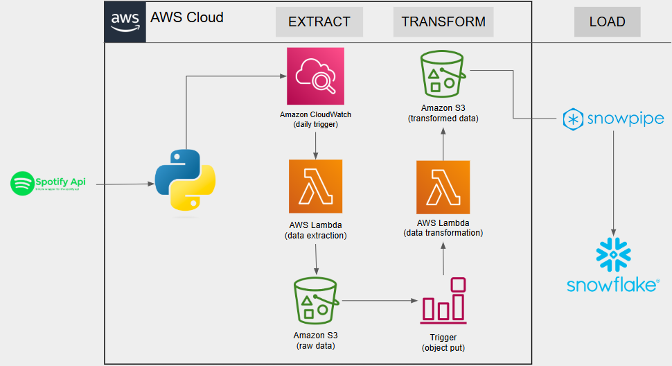

# Spotify Data Engineering Pipeline - AWS to Snowflake Project
## Overview
The **Spotify ETL Pipeline** is a data engineering project designed to extract music data from the Spotify API, transform it into a structured format, and load it into Snowflake for analysis. This pipeline demonstrates an end-to-end data workflow using modern tools and cloud technologies, including **Python, AWS Lambda, Amazon S3,** and **Snowflake**.

The project follows the ETL (Extract, Transform, Load) architecture and leverages Snowpipe for automated data loading into Snowflake. It is designed to run on a daily schedule to collect the latest Spotify data.

## Features

- **Spotify API Integration:** Uses the Spotipy library to fetch data from the Top 100 most streamed playlist.
- **Serverless Architecture:** Implements AWS Lambda for lightweight and scalable data extraction and transformation.
- **Cloud Storage:** Stores raw and transformed data in Amazon S3 buckets.
- **Automated Data Loading:** Utilizes Snowpipe to load transformed data into Snowflake in near real-time.

## Architecture

The pipeline consists of three main stages:

**1. Extract:**

- AWS Lambda function triggered by Amazon CloudWatch fetches data from the Spotify API.
- Raw data is stored in an Amazon S3 bucket.
  
**2. Transform:**

- A second AWS Lambda function is triggered when new raw data is uploaded to S3.
- This function processes and transforms the raw data into a structured format.
  
**3. Load:**

- Transformed data is stored in a separate S3 bucket and ingested into Snowflake using Snowpipe for further analysis.

## Tools & Technologies

- **Programming Language:** Python
- **API Library:** Spotipy (for Spotify API integration)
- **Cloud Services:**
  - AWS Lambda
  - Amazon S3
  - Amazon CloudWatch
- **Data Warehouse:** Snowflake (with Snowpipe for automated data ingestion)
- **Other Tools:** Boto3, Pandas
